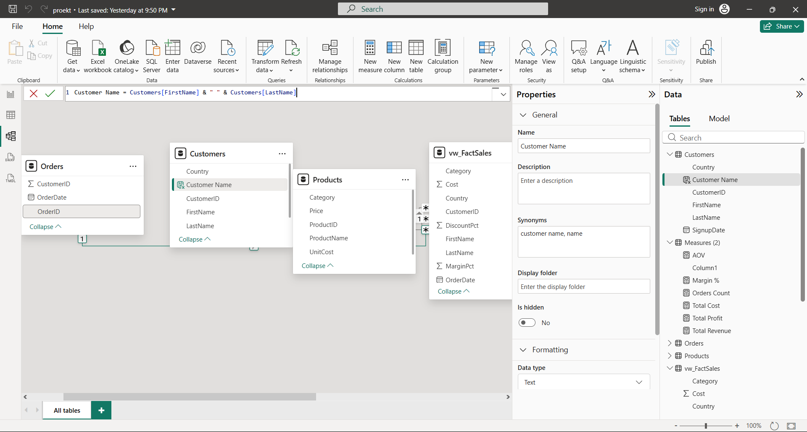
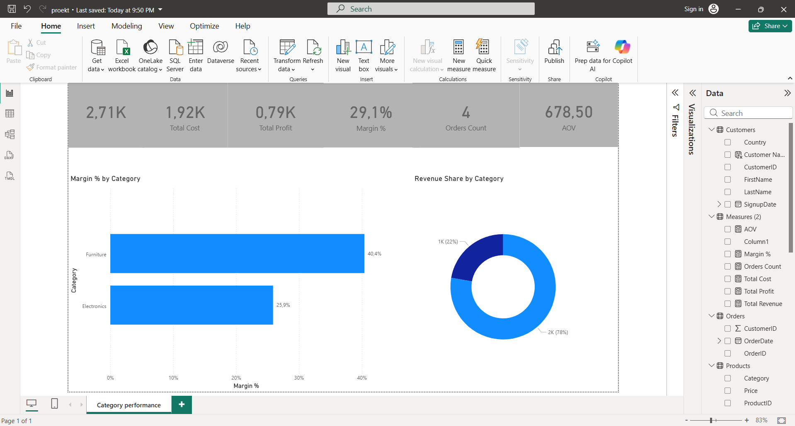

# Retail Sales Performance Dashboard

End-to-end Data Analysis project built using SQL Server and Power BI.

---

## Project Overview

This project analyzes retail sales performance using a star schema data model and business-focused KPIs.

The objective was to simulate a real business scenario and answer key analytical questions related to revenue, profitability, product performance, and customer value.

---

## Tech Stack

- SQL Server
- T-SQL (Views, CTEs, Window Functions)
- Power BI
- Star Schema Modeling

---

## Data Model

The model follows a star schema structure:

- FactSales (SQL View)
- Customers
- Products
- Orders

---

## Dashboard KPIs

The Power BI dashboard includes the following key metrics:

- Total Revenue
- Total Cost
- Total Profit
- Margin %
- Orders Count
- Average Order Value (AOV)

---

## SQL Highlights

The SQL script includes:

- View creation (`vw_FactSales`)
- Revenue, Cost, Profit, Margin calculations
- Aggregations (Top Products, Top Customers)
- Window functions (DENSE_RANK, ROW_NUMBER)
- Running totals (Monthly Revenue)
- JOIN logic (INNER JOIN, LEFT JOIN)
- Business classification using CASE expressions

Full SQL script available here:

[01_retail_sales_dw.sql](sql/01_retail_sales_dw.sql)

---

## Key Business Questions Answered

- Which products generate the highest revenue?
- Which customers are the most valuable?
- How does revenue trend over time?
- What is the overall profit margin?
- How many orders does each customer place?

---

## Author

Pam Stoyanov  
Aspiring Junior Data Analyst
